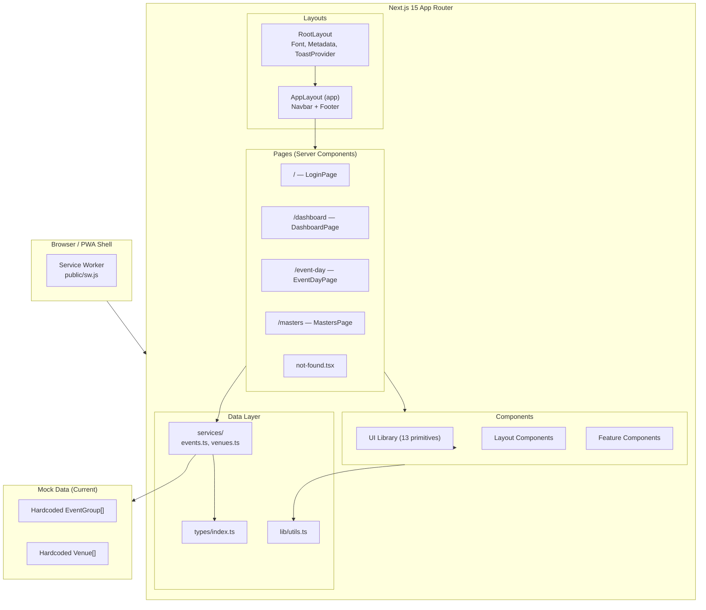
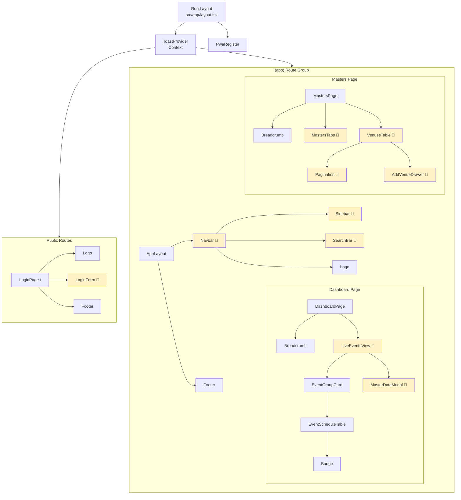
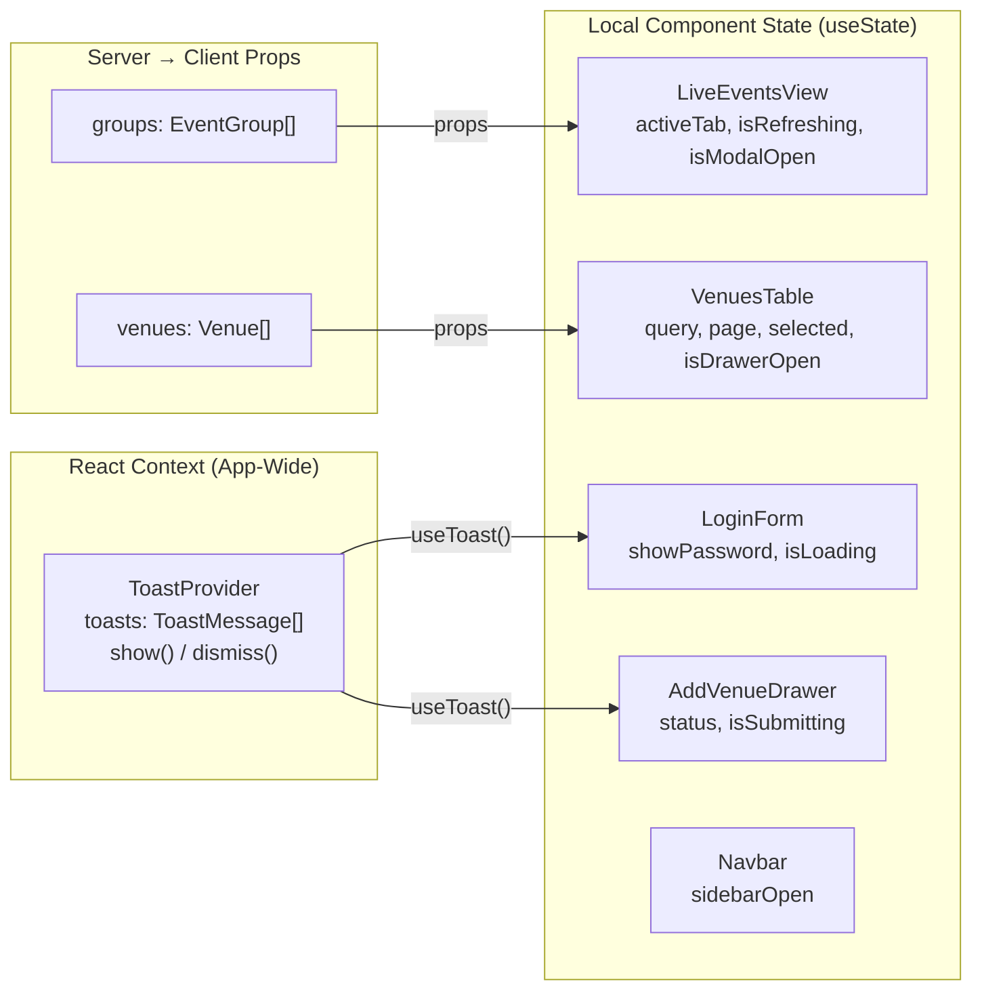
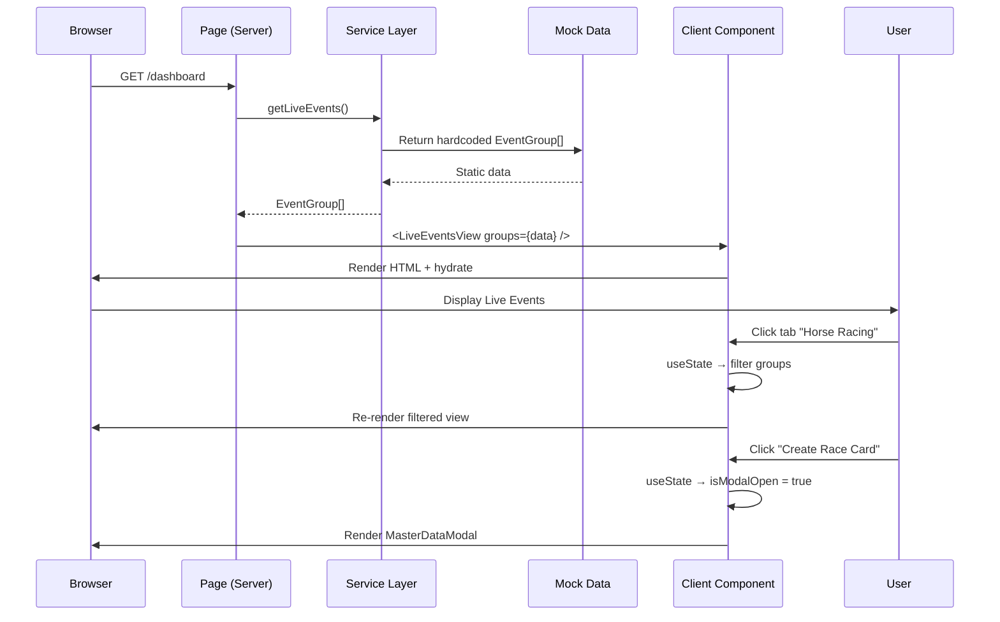
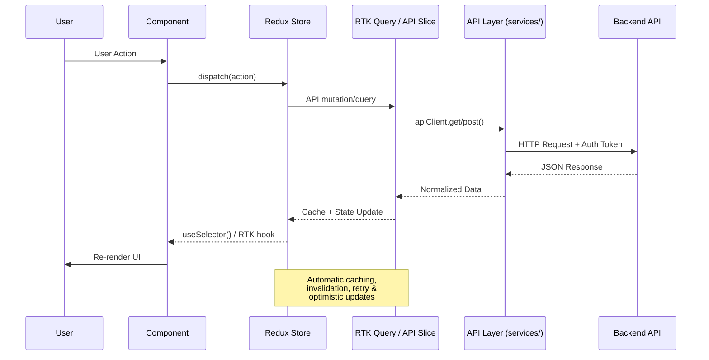
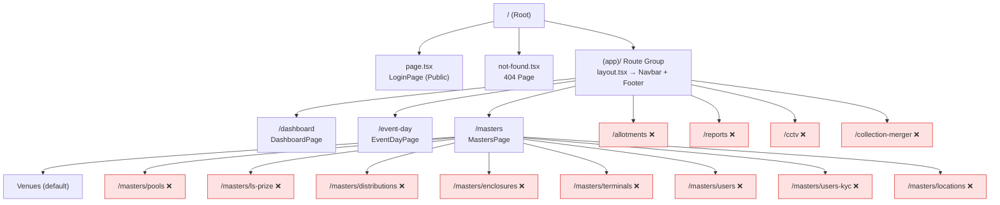

# FortisPlay Admin — Mermaid Architecture Diagrams

> All diagrams are based on actual codebase analysis — no assumptions or inventions.

---

## 1. High-Level Architecture

---

## 2. Component Hierarchy

> 🔶 = Client Component (`'use client'`)

---

## 3. State Management Flow

---

## 4. Current Data Flow

---

## 5. Future Backend Integration Flow (Recommended)

---

## 6. Routing Diagram

> ❌ = Not yet implemented (nav link exists but no page)

---

## 7. Folder Structure Diagram

```mermaid
graph TD
    Root["fortisplay-admin/"]

    Root --> Public["public/"]
    Public --> Icons["icons/"]
    Public --> Manifest["manifest.json"]
    Public --> SWFile["sw.js"]
    Public --> Offline["offline.html"]

    Root --> Src["src/"]

    Src --> App["app/"]
    App --> GlobalCSS["globals.css"]
    App --> RootLayout["layout.tsx"]
    App --> RootPage["page.tsx (Login)"]
    App --> NotFoundPage["not-found.tsx"]
    App --> AppGroup["(app)/"]
    AppGroup --> AppLayoutFile["layout.tsx (Shell)"]
    AppGroup --> DashDir["dashboard/page.tsx"]
    AppGroup --> EventDayDir["event-day/page.tsx"]
    AppGroup --> MastersDir["masters/page.tsx"]

    Src --> Components["components/"]
    Components --> PWA["PwaRegister.tsx"]
    Components --> Auth["auth/"]
    Auth --> LoginFormFile["LoginForm.tsx"]
    Components --> DashComp["dashboard/"]
    DashComp --> EGC["EventGroupCard.tsx"]
    DashComp --> EST["EventScheduleTable.tsx"]
    DashComp --> LEV["LiveEventsView.tsx"]
    DashComp --> MDM["MasterDataModal.tsx"]
    Components --> LayoutComp["layout/"]
    LayoutComp --> NavbarFile["Navbar.tsx"]
    LayoutComp --> SidebarFile["Sidebar.tsx"]
    LayoutComp --> BreadcrumbFile["Breadcrumb.tsx"]
    LayoutComp --> FooterFile["Footer.tsx"]
    LayoutComp --> LogoFile["Logo.tsx"]
    LayoutComp --> NavConfig["nav-config.ts"]
    Components --> MastersComp["masters/"]
    MastersComp --> MT["MastersTabs.tsx"]
    MastersComp --> VTFile["VenuesTable.tsx"]
    MastersComp --> AVD["AddVenueDrawer.tsx"]
    Components --> UIComp["ui/ (13 components)"]

    Src --> Lib["lib/"]
    Lib --> Utils["utils.ts"]
    Src --> ServicesDir["services/"]
    ServicesDir --> EventsSvc["events.ts"]
    ServicesDir --> VenuesSvc["venues.ts"]
    Src --> TypesDir["types/"]
    TypesDir --> TypesIndex["index.ts"]

    Root --> Config["Config Files"]
    Config --> TSConfig["tsconfig.json"]
    Config --> NextConfig["next.config.js"]
    Config --> TailwindConfig["tailwind.config.ts"]
    Config --> ESLintConfig[".eslintrc.json"]
    Config --> PrettierConfig[".prettierrc"]
```

